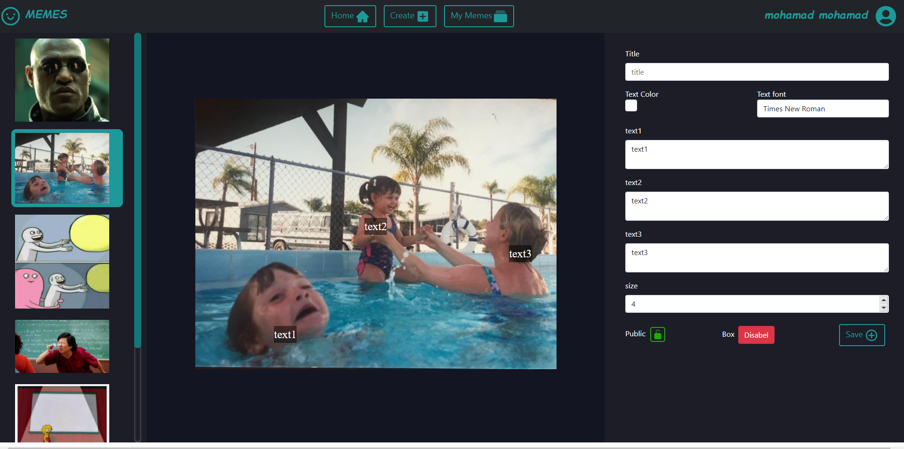

# Exam #2: "Meme Generator"
## Student: s287821 MOHAMAD MOHAMAD

## React Client Application Routes

- Route `/`: redirect to page home/mainPage
- Route `/home/mainPage`: this page show the list of memes (as a preview of each meme) that the user can check , public memes unauthenticated user and all memes for authenticated ones
- Route `/home/mainPage/:id` :this route show the actual meme content of the meme specified with parameter id , further more authenticated users can like or dislike the meme from this page
- Route `/login` :a route for the user to login to his account
- Route `/user` : a route to sign up
- Route `/home/create`: a route for the page where creator generate a meme
- Route `/home/Mymemes`: a route similar to mainPage but it show the list of memes belonging to the current user only 
## API Server

- POST `/api/login`
  - require the credentials of the user to be authenticated (username,password)
  - return user information if successful 
- GET `/api/sessions/current`
  - no parameters
  - check if the current user is authenticated if yes return name and email else return an unnauthenticated user message
- DELETE `/api/sessions/current`
  - log out funcionality 
- GET `/api/memes`
  - no parameters
  - return the list of public memes if the current user is not authenticated or the list of all memes if he is authenticated
- GET `/api/SelfMemes`
  - no parameters
  - return the list of memes belonging to the current authenticated user (user must be authenticated)
- GET `'/api/memes/:id`
  - no parameters
  - return the meme specified by id  with all its attribute ( unlike the list of memes) if the meme was private and the user is not authenticated it return an error
- POST `/api/memes`
  - require the meme to be added attributes (title,image ,texts,alignments,color,font,....)
  - check if layout exists , if not create a layout for the meme (there is a layout table) and than add the meme
- DELETE `/api/memes/:id`
  - no parameters only id
  - delete a meme with id = the specified id only if the meme owner is the authenticated user
- DELETE `/api/likes/:id` / DELETE `/api/dislike/:id`
  - no parameters only id
  - both delete the row associated with current user and memeid=id from like_dislike table (same logic)
- GET `'/api/like_dislike/:id`
  - no parameters only id
  - return the dislike or like event associated with memeid=id and current user , if user didn;t like or dilike the meme return 0

- POST `/api/like/:id`
  - no parameters only id
  - check if previous like or dislike event occured for meme (id) and current user if a like event occured return error
  if a dislike event occured delete it and add the new like event if none occured add the new like event

- POST `/api/dislike/:id`
  - no parameters only id
  - check if previous like or dislike event occured for meme (id) and current user if a dislike event occured return error
  if a like event occured delete it and add the new dislike event if none occured add the new dislike event

- POST `/api/createUser`
  - name,email,password
  - check if email is used , if not create user else return a email is used error message
  
  there is a delete ad put api for user but they are not used

## Database Tables

- Table `users` - contains name ,email, hashpassword
- Table `layout` - contains layout id , the image  , the align1 of text1,align2 of text2,align3 of text3
- Table `memes` - contains meme id , the title  , private,user that the meme belong to , date of creation , text1 , text2 , text3 , font type, color, size of text , layout id that link the meme to its layout of table layout , box attribute wich can be 0 or 1 to specify if the user want a faded black box behind the text in case the background image is too shiny ,nblikes , nb dislikes
- Table `likes` - contains meme_id ,user, like_dislike event  0 for dislike 1 for like 
- 2 Triggers  one for insert into likes and one for delete to update the nb likes and dislikes of the meme 

## Main React Components

- `LoginForm` (in `LoginPage.js`): a form for loging in
  - text box to fill the email and password 
  - an eye icon to show or hide the password
  - a home button that redirect the user to home page , and a sign up button that redirect the user to sign up page
  - a login button that validate evrything and send the login request to the server + sum error message functionality

- `CreateUserForm` (in `SignUp.js`): a form forcreating a new user
  - text box to fill the name email , password and to confirm password 
  - 2 eye icon to show or hide the passwords
  - a create user button that validate evrything and send  create user request to the database , with messages for validation (exmaple password and confirm password are diff)

- `HomePage` (in `HomePage.js`) : a list of bootsrap cards , each card contain:
  - the image of the meme without the texts as a preview
  - the `by user` field that spercify the creator ofthe meme
  - meme title
  - a set of buttons : 
    -check out to check the meme and redirect to the home/mainpage/:id 
    -copy which appear only if the user is authenticated (creator) and preload the meme creation page with the choosen meme to copy
    -delete appear only if the authenticated user is the creator of the meme , delete the meme
  - a time attribute which show how much time passed since the meme creation
  - a privacy label to show the privacy state of the meme
  note :the homepage is used to show the list of users meme in Mymeme route by specifying a parameter (mymeme=1)

- `Elements` (in `navbar.js`): a set of 3 buttons
  - home button that redirect the user to mainpage 
  - create button that redirect user to the creation page
  - myMeme button which redirect user to his meme page
  - only the home button is shown in case user is not authenticated

-`User_icon` (in `navbar.js`): contain the login and log out functionality
  -login is a button that redirect user to login page
  -log out is an element in dropdown menu that appear after clicking on the user icon 

-`Meme` (in `memeShow.js`):a page to show the meme :
  -image of the meme with all its texts
  -the user and the meme title
  -the copy and delete button same as in card but delete here redirect to homepage
  -like and dislike icons to like or dislike the meme + nb likes and dislike for the meme
  -time which show how much time passed since the meme creation

-`ImageList` (in `createMeme.js`): a list to show the meme background images tonselect from , it wont be visible in case of a copy

-`Fields` (in `createMeme.js`): a form to fill the meme attribute
  -a text fied for title
  - color selector 
  - dropdown for font type
  - 3 multyline text field for meme texts
  - a number input to change the size of texts
  - privacy input , keep the box behind the text input 
  - save button that validate that at least one text is filled +title and an image is choosen and save the meme

## Screenshot

## Users Credentials

- username, password (plus any other requested info)
- username, password (plus any other requested info)
